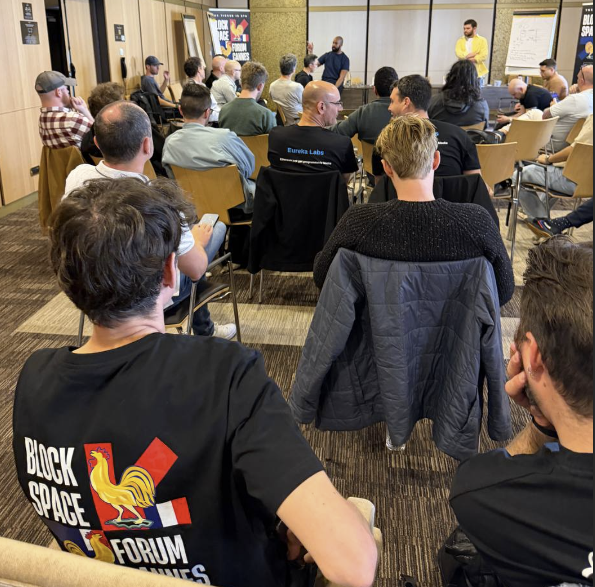
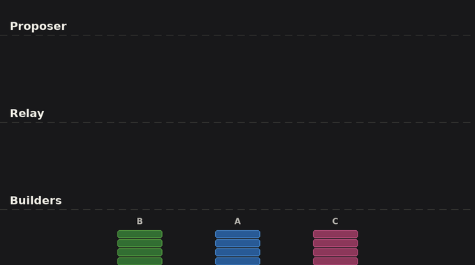
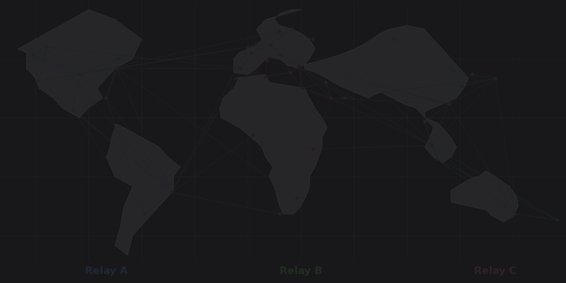

## **Blockspace Workshop Cannes 2026**

**TL;DR:** The workshop surfaced discussions and ideas around a concrete roadmap for upgrading the block construction pipeline. The discussions mainly centered around a concept called block merging that helps address many of the structural gaps in today's transaction journey. Conceptually this allows multiple builders to contribute to the same block leading to better aligned order flow incentives, fuller blocks, cheaper transactions, increasing value and censorship resistance. The latter part of the day also had extensive discussion on sub-slot auctions that split the slot into shorter intervals, giving users faster execution confirmations without any protocol changes.

[See all talks from the workshop](../../events.html#talks)

## **Background**

Ethereum's product is blockspace: scarce, verifiable compute and storage sold one block at a time, every 12 seconds. Over 90% of this blockspace is allocated through the out-of-protocol PBS (proposer-builder separation) pipeline, where specialized builders construct blocks and neutral relays run auctions on behalf of proposers. The pipeline works and has successfully mitigated proposer centralization, but it has structural problems.

The **Blockspace Forum** hosted its second workshop on the block construction pipeline in Cannes, on April 1st 2026\. The first forum, held in Buenos Aires during Devconnect in November 2025, established consensus on those structural problems. This second forum moved from diagnosis to discussing various solutions to address the structural gaps.

The workshop was attended by 32 teams, including block builders and relays accounting for more than 95% of all blocks constructed out of protocol. This post captures the outcomes and key concepts surfaced throughout the day; as the workshop followed Chatham House Rules, contributions are not attributed to individuals or teams, but reflected in their essence.

*The Cannes 2026 Blockspace Forum Workshop*

Additional technical background is included in the [introductory presentation](https://docs.google.com/presentation/d/1YcNJvSYknFiZrKnqxd05gjPDGoyXowwBPnxhBPjpPLQ/edit), and the Buenos Aires takeaways are [detailed on ETHresearch](https://ethresear.ch/t/an-observation-on-ethereum-s-blockspace-market/23669).

### **Kicking-off The Day Summarizing The Structural Gaps**

The day began with a short discussion on [structural gaps](https://x.com/blockspaceforum/status/2026671024348054009) in the current transaction pipeline:

* **Economics.** Originators are incentivized to send transactions exclusively to a single builder, because broadcasting to multiple builders causes priority fees to get competed away in the relay auction. As a result, builders construct blocks from partial views, blockspace goes underutilized, and relays have no sustainable revenue model despite performing critical infrastructure functions.
* **Robustness.** Winner-take-most dynamics shrink the active builder and relay set, raising correlated failure risk from implementation monocultures, shared infrastructure, and jurisdictional pressure.
* **Performance.** No explicit queuing, scheduling, or deadline mechanisms exist along the hot path. Tail latency is high. Users overpay to hedge uncertainty. The 12-second slot creates a structural UX gap compared to chains with faster block times.
* **Services.** Proposers cannot easily express preferences about block contents. Preconfirmations and other services require bilateral integration with every builder and relay, creating a cold-start problem.

The rest of the day's goal was to work towards solutions to address these challenges. We structured this as workshops across three sessions, covering economic coordination, information sharing, and performance. Each session builds on the previous, culminating in a multi-party block building design that allows transactions from multiple builders to find inclusion in sub-slot time.

## **Session 1 Part A: Landscape of Approaches**

To begin, teams highlighted the various out-of-protocol block construction solutions multiple teams are working on. The workshop surveyed four active approaches, which are complementary rather than competing:

* **BuilderNet** (Flashbots, Beaverbuild, Nethermind) uses TEEs to reduce trust assumptions and enable shared order flow.
* **TOOL / Nuconstruct** targets sub-slot-driven early execution confirmations with an open collaborative environment.
* **ETHGas** explores crypto-economically backed preconfirmations and futures to price inclusion risk and smooth fees.
* **mev-commit** develops preconfirmations and block positioning bids for inclusion**.**
* **Relay block merging** (Gattaca/Titan, BTCS, Ultrasound, Aestus) reconciles fragmented order flow by appending non-contentious transactions to the winning block at the relay level. Already in testing.

These approaches satisfy different transaction originator preferences, and multiple solutions are expected to succeed in parallel. They share a structural observation: coordination improves blockspace allocation. An approach that had not yet been attempted was using existing infrastructure and parties to address the current structural gaps across multiple builder solutions.

The sessions took this as a starting point. Rather than picking one approach, the group asked: **how can neutral infrastructure be used to improve blockspace allocation across all builders, and what benefits does this provide?**

## **Session 1 Part B: Economic Coordination**

Next, we leaned into a discussion to work towards addressing Ethereum blockspace's structural inefficiencies driven by economic incentives: originator incentives leading to exclusive flow, a lack of hedging markets burdening originators with volatility risks, and a lack of economic incentives for relays.

One of the first ideas surfaced was that coordination can start to help address these challenges by allowing multiple builders to contribute their exclusive transactions to the final block, raising blockspace utilization and block value, while allowing users to find faster inclusion. Validators \- the only monopolists in the block building pipeline \- can offer services with the certainty that these will be respected by builders.

Through this conversation, teams identified that the relay sits at the point where all order flow converges; across all relay instances, every transaction is visible. The existing trust relationship between relays and builders means that relays could potentially change their role without expanding the trust surface. An early proposal of such a coordination layer was [relay block merging](https://ethresear.ch/t/relay-block-merging-boosting-value-censorship-resistance/22592). The rest of session 1 focused on this, and extended the proposal in multiple ways to allow active use by many teams, paving the way for a broad mainnet rollout.

Those at the sessions highlighted that a trusted party facilitating the value exchange between builders and proposers, relays or actors like relays can offer critical services like bid cancellations, price discovery, and block propagation. Due to these services, the group agreed that relays will continue to deliver the majority of blocks even after ePBS (enshrined proposer-builder separation) establishes a canonical direct channel between builders and proposers.

Relays can use their complete view of order flow and proposer preferences to combine ("merge") blocks from multiple builders, strictly increasing block value and censorship resistance. Increasing the number of parties contributing to the block building pipeline makes Ethereum more neutral, and constitutes [a desirable "end game"](https://x.com/VitalikButerin/status/2028524112868708616) for the block construction pipeline.

Multiple builder solutions including Buildernet and TOOL use TEEs to provide trust guarantees to originators. The group discussed that relays, as the interface to the proposer, can deploy TEE-based instances to carry forward these trust guarantees, and verifiably reconcile blocks constructed within TEEs with blocks constructed by builders that do not use TEEs. These "trust zones" therefore combine verifiable privacy guarantees mandated by originators or proposers with the benefits of merging.

The mechanism discussed as a starting point is straightforward to understand and implement (we chose to make fancy animations versus showing the white board chicken scratch\!):

1. An actor in a relay-like role identifies non-contentious transactions from losing builders that do not conflict with the transactions in the winning block.
2. These are appended to the winning block, increasing blockspace utilization and block value.
3. The merged block is only delivered to the proposer if its value exceeds the best unmerged block.
4. The newly created value is distributed to the winning builder, contributing builders, the relay, and the proposer.

*The above graphic shows how block merging adds transactions from multiple blocks onto the winning block at the neutral level currently served by the relay role, improving blockspace utilization and block value.*

A second round of communications between relays and builders was discussed, which could allow builders to add additional transactions previously unavailable to them. This was extended into a sub-slot design detailed in section 3\.

### **Extensions from the Workshop**

The workshop extended the basic merging proposal in several ways, to accommodate additional use cases and improve compatibility:

**Prepending.** Allowing relays to prepend transactions (not just append) unlocks use cases like ad hoc liquidity pricing through oracle updates, improving both UX and block value. Downstream effects include fresher on-chain pricing which improves trade outcomes for Ethereum users and liquidity providers.

**Enforcement of proposer services.** Relays can merge in transactions to satisfy proposer commitments such as preconfirmations, reducing the need for every builder to individually integrate every constraint protocol.

**Small builder economics.** Merging removes barriers to entry. New builders can contribute transactions to blocks without needing to win an entire slot. Private transactions can find inclusion even when they are not known to the winning builder. This improves fair access.

**Relay compensation.** Relays can be compensated from a share of the additional block value created through merging, providing income that scales with their value-add. This contrasts with monetization through bid adjustments, which decrease block value in expectation. The exact compensation mechanism is as yet unclear, with a fixed percentage split between the winning builder, contributing builder, relay, and proposer acknowledged as a temporary placeholder.

### **Practical Considerations**

The following practical concerns were discussed, ahead of a mainnet deployment:

* **Determinism and simplicity:** Relays execute simple operations like appends to extend blocks. The increasing sophistication of relays was brought up as a concern, and must be kept to a minimum.
* **Attribution:** If multiple builders provide the same mergeable transaction, it is attributed to whichever builder bid higher in the block auction. This incentivizes competitive bidding.
* **UX:** Builders label transactions and blocks as available for merging to avoid accidental unbundling, unexpected latency, and to preserve agreements with order flow originators.
* **State root overhead:** Builders share Merkle paths with relays to allow for fast state root recomputation. This is the same technique builders already use for bid adjustments during the auction.

## **Session 2: Information Sharing**

The improvements from Session 1 work within a single relay. Relays do not operate in isolation, and information sharing across relay instances and with builders and proposers improves economic guarantees and service quality, while reducing failure risks. In session 2, teams discussed what specific information can be shared to increase blockspace utilization and block value jointly.

Modern peer-to-peer networking techniques like random linear network coding (RLNC) were presented in detail, as a way to share information fast and reliably. While the relay set is small and typically connected directly, optimized P2P interfaces could better connect attesters and positively impact performance \- this direction was carried forward into session 3\. From this discussion most of the group agreed that there are technical improvements that could improve the performance of the network and infrastructure providers supporting it. Someone in the group recommended a good textbook on network encoding (linked [here](https://www.wiley.com/en-sg/Network+Coding+for+Engineers-p-9781394217298)).

### **What Can Be Shared**

From this initial discussion, the group identified three initial categories of information that are mutually beneficial to share, requiring no competitive sacrifice: Payloads, Constraints, and Demotions.

**Payloads.** Currently, relays rely on their own infrastructure to propagate blocks signed by the proposer to the wider network. As relays are trusted, execution payloads can be shared between them and propagated through multiple channels. This reduces the chance of a missed slot.

*Joint payload propagation allows remote proposers to access more competitive blocks through improved geographic coverage.*

This design improves block value and decentralization by increasing geographic coverage, benefitting the network by making more valuable blocks available to proposers in remote geolocations. The group acknowledged that relays must be trusted to allow payload propagation, as a rogue relay could front-run transactions contained in the payload.

**Constraints.** Service quality for proposer commitments can be improved by sharing constraints at the beginning of the slot. As relays verify that builder blocks satisfy proposer constraints, this sharing step improves enforcement by making all relays aware of the constraints for the slot. This reduces failure risk and improves pricing through better verification.

Constraint sharing also allows relays to actively enforce proposer commitments, reducing the need for builders to support every protocol individually. Relays can then compete on which protocols they support, extending proposer choice and improving portability.

The concern was raised that some constraints may not be suitable for sharing due to state-sensitive transactions. This can be addressed by allowing trust assumptions to be specified by constraint protocols, and by limiting constraints sharing to relays trusted by the proposer.

**Demotions.** Robustness can be improved by sharing information on builders submitting invalid blocks. This allows relays to stop invalid blocks from being proposed, and increases capital efficiency by allowing builders to share collateral across relays enforcing the same view. The group noted that this increased capital efficiency benefits smaller builders with limited collateral.

### **Practical Considerations**

The following practical concerns were discussed, ahead of a mainnet deployment:

* **Latency:** Only new or changed transactions need to be shared between relays, as most of the block does not change between bid updates.
* **Proposer heartbeat:** Proposers could share a heartbeat or similar networking data, allowing builders and relays to hold the auction close to the proposer and increasing coverage of geographically remote locations.
* **Payload verification:** Relays must share `getPayload` requests signed by the proposer to enable joint payload propagation. These are verifiable and safe to share.
* **Demotion evidence:** Relays share an identifier (index) of the builder submitting invalid blocks, with the hash of the invalid block attached as evidence. Relays locally verify the demotion. An internal trust score can trigger a circuit breaker before verification is complete.

The economic alignment from Session 1 and the coordination infrastructure from Session 2 unlock a larger design: splitting block construction into sub-slot auctions that provide users with fast execution guarantees within the existing 12-second Ethereum slot. This allows more parties to contribute to any block and users to trade more frequently, increasing blockspace utilization, block value, and censorship resistance.

This discussion directly builds on a desire by multiple teams to augment block merging with a second round of communications between relays and builders. Sub-slots allow higher cadence coordination between relays and builders; as a consequence, more builders can contribute to each block.

### **Background and Design**

Information sharing allows relays to efficiently coordinate on block content within a slot. Performance improvements such as joint block propagation and a proposer heartbeat allow relays and builders to reduce network overhead by running the auction in the geographic instance closest to the proposer. These improvements make it feasible to split the slot into multiple sub-slot auctions. The group acknowledged that sub-slot designs were previously proposed by Nuconstruct as TOOL, and by EthGas as sub-blocks.

For each sub-slot, builders compete in a standard auction. Relay operators select the highest bid and carry forward the resulting state as the base for the next sub-slot. The design is fully compatible with block merging, which is run for each sub-slot. Different builders can win different sub-slots, achieving multi-party block construction, multiple times, within a single Ethereum slot.

Builders need to know what state of the chain to add to, and for this reason, relays need to agree on a single sub-slot winner before moving to the next sub-slot. This is simpler than it sounds, as relays only need to agree on the globally highest bid; they do not need to decide on transaction ordering (which is handled by builders). This only requires that each operator shares its best bid and carries forward the globally highest value; this mirrors how [multi-relay inclusion lists](https://ethresear.ch/t/block-constraints-sharing-multi-relay-inclusion-lists-beyond/22752) work.

The minimum viable sub-slot duration is bounded by network latency, which can be managed by features such as the proposer heartbeat and optimized P2P layer discussed in Session 2\. These features could be implemented in a sidecar (e.g. as a commit-boost module), and multiple P2P layers could be run in parallel. The group agreed that the exact sub-slot duration should start conservatively and be tuned based on network conditions; during the workshop, a reasonable initial duration was tentatively set at 1 second.

The economic benefits of shorter slots were discussed, with general agreement that shorter slots will stimulate user activity by allowing multiple sequential transactions within a block. There were concerns that the value of CEX/DEX arbitrage transactions could be reduced by shorter block times, leading to reduced block value overall. The size and direction of the effect is as yet unclear and subject to empirical investigation. Similarly, the point was raised that longer slot times could allow for more coincidences of wants; a counterpoint was that order batching is already handled out of protocol by specialized applications.

In the initial version (v1), relay operators form a trusted, permissioned set, with the exception of the TEE-based relay instances discussed in session 1\. This is a pragmatic setup for shipping but not a permanent state. Under Attester-Proposer Separation (APS), proposers become sophisticated entities that can serve as neutral tiebreakers for bid selection, removing reliance on relay consensus. The system is designed to evolve toward permissionless operation, but the group emphasized: ship V1 now, let APS upgrade the trust model later.

*The sub-block with the most valuable bid is carried forward to the next sub-slot.*

### **Impact for Users and Ethereum**

The group identified the following benefits of the design:

**Faster confirmations.** Users receive intermediate confirmations after each sub-slot (~1 second) rather than waiting the full 12 seconds. This makes transacting on Ethereum L1 feel faster without requiring any protocol changes, and allows multiple sequential transactions per slot.

**More competition.** Today, a single builder with the best exclusive order flow wins the entire slot. Sub-slots allow multiple builders to contribute to a single final block.

**Better censorship resistance.** More sub-slots mean more frequent inclusion opportunities. Transactions that would have been excluded by the winning builder can find inclusion in later sub-slots or through merging.

**Composability with merging.** Transactions can be merged in by the relay for each sub-slot, preserving full compatibility with the block merging design from Session 1\. This further increases block value, censorship resistance, and the number of parties contributing to blocks.

Downside risks raised include the option for the proposer to defect and propose a block sourced from a different channel, which would render the execution confirmations provided to users moot. For some, this is an acceptable risk if limited to a very small percentage of slots; another solution discussed is opaque bidding, which will not allow the proposer to determine whether a block sourced elsewhere is more valuable.

## **What Comes Next**

The workshop surfaced concrete next steps that will be jointly implemented in the coming months:

1. **Block merging and information sharing** are the most immediately deployable mechanisms. A testnet pilot is ongoing and will be extended into a mainnet deployment in the next weeks; an open source reference implementation is [available here](https://github.com/gattaca-com/helix/pull/212)
2. **Sub-slot auctions** will be specced in a follow-on research post on multi-party block construction.

Together, block merging and sub-slot auctions unlock scalable multi-party block construction by allowing multiple parties to contribute to blocks multiple times per slot. This will be discussed in a future research post.

### **Open Questions**

* **Value distribution.** How is surplus from merging allocated across builders, relays, proposers, and originators? The current placeholder is an equal 25% split, acknowledged as crude.
* **Governance.** Who decides on the parameters of the system, such as slot duration, compensation, and trust assumptions?
* **Sub-slot parameterization.** What is a suitable slot duration? This will be answered empirically, with network latency for remote proposers as a prudent floor.
* **Preconfirmation interaction.** How do preconf constraints interact with sub-slot boundaries? Per-sub-slot preconfs offer finer granularity but add complexity.
* **Protocol relationship.** ePBS, FOCIL, and shorter in-protocol slot times should all be compatible with these designs. Ensuring convergence between out-of-protocol and in-protocol evolution is an ongoing design challenge.

## **Summary**

Merging and sub-slots combine into scalable multi-party block building. This increases block value, censorship resistance, user experience, and makes Ethereum a more competitive and neutral venue. The following table summarises the improvements discussed in the workshop:

|  | Today | Multi-Party Block Building (merging) | Multi-Party Block Building (merging + subslots) |
| ----- | ----- | ----- | ----- |
| **Who builds the block** | One winning builder | Winning builder + contributing builders via relay | Multiple builders across ~12 sub-slots + merging |
| **Inclusion opportunities per slot** | 1 (winning builder) | 2 (winning builder + merging) | Up to 24 for 1s sub-slots (winning builder + merging, per sub-slot) |
| **User confirmation latency** | 12 seconds | 12 seconds | ~1 second |
| **Relay Compensation** | None | Share of surplus generated for the slot | Share of surplus generated for multiple sub-slots |
| **Builder entry barrier** | Must win entire slot | Can contribute to winning block | Can win sub-slots and contribute to sub-slots |
| **Censorship resistance** | Limited to winning builder's inclusion | Winning builder's inclusion + merging | Multiple builder's inclusion + merging |

*The Blockspace Forum will soon return for its third installment*
