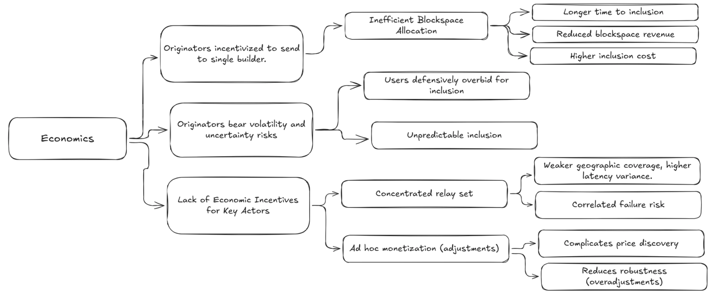

## **Blockspace Workshop Cannes 2026**

**TL;DR:** The workshop surfaced a concrete roadmap for upgrading the block construction pipeline. Block merging allows multiple builders to contribute to the same block, increasing value and censorship resistance. Inter-relay information sharing improves service quality and reduces failure risk. Sub-slot auctions split the 12-second slot into  ~1 second intervals, giving users faster execution confirmations without any protocol changes. These mechanisms compose: merging feeds into sub-slots, and information sharing enables the coordination both require.

## **Background**

Ethereum's product is blockspace: scarce, verifiable compute and storage sold one block at a time, every 12 seconds. Over 90% of this blockspace is allocated through the out-of-protocol PBS (proposer-builder separation) pipeline, where specialized builders construct blocks and neutral relays run auctions on behalf of proposers. The pipeline works and has successfully preserved proposer independence, but it has structural problems.

The **Blockspace Forum** hosted its second workshop on the block construction pipeline in Cannes, on April 1st 2026. The first forum, held in Buenos Aires in November 2025, established consensus on those structural problems. This second forum moved from diagnosis to solutions.

The workshop was attended by 32 teams, including block builders and relays accounting for more than 95% of all blocks constructed out of protocol.

Additional technical background is included in the [introductory presentation](https://docs.google.com/presentation/d/1YcNJvSYknFiZrKnqxd05gjPDGoyXowwBPnxhBPjpPLQ/edit), and the Buenos Aires takeaways are [detailed on ETHresearch](https://ethresear.ch/t/an-observation-on-ethereum-s-blockspace-market/23669).

### **The Problem in Brief**

The PBS pipeline faces challenges across four categories:

* **Economics.** Originators are incentivized to send transactions exclusively to a single builder, because broadcasting to multiple builders causes priority fees to get competed away in the relay auction. As a result, builders construct blocks from partial views, blockspace goes underutilized, and relays have no sustainable revenue model despite performing critical infrastructure functions.  
* **Robustness.** Winner-take-most dynamics shrink the active builder and relay set, raising correlated failure risk from implementation monocultures, shared infrastructure, and jurisdictional pressure.  
* **Performance.** No explicit queuing, scheduling, or deadline mechanisms exist along the hot path. Tail latency is high. Users overpay to hedge uncertainty. The 12-second slot creates a structural UX gap compared to chains with faster block times.  
* **Services.** Proposers cannot easily express preferences about block contents. Preconfirmations and other services require bilateral integration with every builder and relay, creating a cold-start problem.

Coordination between builders and relays can address all four, as relays serve as a clearinghouse for all PBS blocks. The day was split into three sessions covering economic coordination, information sharing, and performance. Each session built on the previous, culminating in a sub-slot auction design that composes merging and information sharing into a unified system.

### **Landscape of Approaches**

Multiple teams are working on these problems from different angles. The workshop surveyed four active approaches, which are complementary rather than competing:

* **BuilderNet** (Flashbots, Beaverbuild, Nethermind) reduces information asymmetries between builders through TEE-based verifiability, enabling order flow sharing without information leakage and credible refund mechanisms for originators.  
* **TOOL / Nuconstruct** operates a network of TEE nodes that process order flow privately and divide the block into  ~1 second sub-slots, giving participants multiple shots at inclusion per slot.  
* **ETHGas** provides crypto-economically backed preconfirmations and blockspace futures, with relay-enforced inclusion guarantees.  
* **Block merging** (Gattaca/Titan, BTCS, Ultrasound, Aestus) reconciles fragmented order flow by appending non-contentious transactions to the winning block at the relay level. Already in testing.

These approaches satisfy different transaction originator preferences, and multiple solutions are expected to succeed in parallel. They share a structural observation: coordination improves blockspace allocation. The relay sits at the point where all order flow converges; across all relay instances, every transaction is visible. The existing relationship between relays and builders means that relays can take on new coordination roles. 

The sessions took this as a starting point. Rather than picking one approach, the group asked: **what can the relay layer do today to improve blockspace allocation across all builder solutions, and how far can that be pushed?**

## **Session 1: Economic Coordination**

Ethereum's blockspace economics are constrained by structural inefficiencies: originator incentives leading to exclusive flow, a lack of hedging markets burdening originators with volatility risks, and a lack of economic incentives for relays.

*The structural inefficiencies in blockspace economics, from the Blockspace Forum Buenos Aires. [More in the introductory presentation](https://docs.google.com/presentation/d/1YcNJvSYknFiZrKnqxd05gjPDGoyXowwBPnxhBPjpPLQ/edit).* 

Coordination addresses each of these challenges. Multiple builders can contribute their exclusive transactions to the final block, raising blockspace utilization and block value, while allowing users to find faster inclusion. Validators - the only monopolists in the block building pipeline - can offer services with the certainty that these will be respected by builders. Relays can facilitate this coordination as a neutral layer, earning compensation proportional to the value they generate. 

An early proposal of such a coordination layer was [block merging](https://ethresear.ch/t/relay-block-merging-boosting-value-censorship-resistance/22592). The workshop extended this proposal in multiple ways, paving the way for a broad mainnet rollout.    

### **The Role of the Relay & Block Merging**

As the party facilitating the blockspace auction between builders and proposers, relays offer critical services like bid cancellations, price discovery, and block propagation. Due to these services, we suspect relays will continue to deliver the majority of blocks even after ePBS (enshrined proposer-builder separation) establishes a canonical direct channel between builders and proposers.

Relays can use their complete view of order flow and proposer preferences to combine (“merge”) blocks from multiple builders, strictly increasing block value and censorship resistance. Increasing the number of parties contributing to the block building pipeline makes Ethereum more neutral, and constitutes [a desirable “end game”](https://x.com/VitalikButerin/status/2028524112868708616) for the block construction pipeline. 

The mechanism is straightforward to understand and implement: 

1. The relay identifies non-contentious transactions from losing builders that do not conflict with the winning block.  
2. These are appended to the winning block, increasing blockspace utilization and block value.  
3. The merged block is only delivered to the proposer if its value exceeds the best unmerged block.   
4. The newly created value is distributed to the winning builder, contributing builders, the relay, and the proposer. 

*Block merging adds transactions from multiple blocks onto the winning block, improving blockspace utilization and block value* 

A public reference implementation of this value flow [is available](https://github.com/gattaca-com/helix/pull/212) and in active testing. 

### **Extensions from the Workshop**

The workshop extended the basic proposal in several ways:

**Prepending.** Allowing relays to prepend transactions (not just append) unlocks use cases like ad hoc liquidity pricing through oracle updates, improving both UX and block value. Downstream effects include fresher on-chain pricing which improves trade outcomes for Ethereum users and liquidity providers. 

**Enforcement of proposer services.** Relays can merge in transactions to satisfy proposer commitments such as preconfirmations, reducing the need for every builder to individually integrate every constraint protocol. This bypasses the cold-start problem: 3-5 relay operators implement support once, rather than requiring adoption across the entire builder set.

**Small builder economics.** Merging removes barriers to entry. New builders can contribute transactions to blocks without needing to win an entire slot. Private transactions can find inclusion even when they are not known to the winning builder. This directly improves fair access.

**Relay compensation.** Relays can be compensated from a share of the additional block value created through merging, providing income that scales with their value-add. This contrasts with monetization through bid adjustments, which decrease block value in expectation.

### **Practical Considerations** 

* **Determinism and simplicity:** Relays execute simple operations like appends to extend blocks. The sophistication of the relay is kept to a minimum.  
* **Attribution:** If multiple builders provide the same mergeable transaction, it is attributed to whichever builder bid higher in the block auction. This incentivizes competitive bidding.  
* **UX:** Builders label transactions and blocks as available for merging to avoid accidental unbundling, unexpected latency, and to preserve agreements with order flow originators.  
* **State root overhead:** Builders share Merkle paths with relays to allow for fast state root recomputation. This is the same technique builders already use for bid adjustments during the auction.

## **Session 2: Information Sharing**

The improvements from Session 1 work within a single relay. Relays do not operate in isolation, and information sharing across relay instances and with builders and proposers improves economic guarantees and service quality, while reducing failure risks. In session 2, teams discussed what specific information can be shared to increase blockspace utilization and block value jointly. 

### **What Can Be Shared**

**Payloads.** Currently, relays rely on their own infrastructure to propagate blocks signed by the proposer to the wider network. Execution payloads can be shared between relays and propagated through multiple channels. This reduces the chance of a missed slot.

*Joint payload propagation allows remote proposers to access more competitive blocks through improved geographic coverage.*

This design improves block value and decentralization by increasing geographic coverage, benefitting the network by making more valuable blocks available to proposers in remote geolocations. 

**Constraints.** Service quality for proposer commitments can be improved by sharing constraints at the beginning of the slot. As relays verify that builder blocks satisfy proposer constraints, this sharing step improves enforcement by making all relays aware of the constraints for the slot. This reduces failure risk and improves pricing through better verification.

Constraint sharing also allows relays to actively enforce proposer commitments, reducing the need for builders to support every protocol individually. Relays can then compete on which protocols they support, extending proposer choice and improving portability. In practice, some constraints may not be suitable for public sharing due to state-sensitive transactions; these limitations can be flagged by constraint protocols.

**Demotions.** Robustness can be improved by sharing information on builders submitting invalid blocks. This allows relays to stop invalid blocks from being proposed, and increases capital efficiency by allowing builders to share collateral across relays enforcing the same view. 

*How information sharing reduces service bottlenecks across the relay ecosystem.*

### **Practical Considerations**

* **Latency:** Only new or changed transactions need to be shared between relays, as most of the block does not change between bid updates.  
* **Proposer heartbeat:** Proposers could share a heartbeat or similar networking data, allowing builders and relays to hold the auction close to the proposer and increasing coverage of geographically remote locations.  
* **Payload verification:** Relays must share `getPayload` requests signed by the proposer to enable joint payload propagation. These are verifiable and safe to share.  
* **Demotion evidence:** Relays share an identifier (index) of the builder submitting invalid blocks, with the hash of the invalid block attached as evidence. Relays locally verify the demotion. An internal score can trigger a circuit breaker before verification is complete.

## **Session 3: Performance**

The economic alignment from Session 1 and the coordination infrastructure from Session 2 unlock a larger design: splitting block construction into sub-slot auctions that provide users with fast inclusion confirmations within the existing 12-second Ethereum slot. This allows more parties to contribute to any block and users to trade more frequently, increasing blockspace utilization, block value, and censorship resistance. 

*Performance bottlenecks in the current block construction pipeline.*

### **Background and Design**

Information sharing allows relays to efficiently coordinate on block content within a slot. Performance improvements such as joint block propagation and a proposer heartbeat allow relays and builders to reduce network overhead by running the auction in the geographic instance closest to the proposer.  These improvements make it feasible to split the slot into multiple sub-slot auctions. 

For each sub-slot, builders compete in a standard auction. Relay operators select the highest bid and carry forward the resulting state as the base for the next sub-slot. The design is fully compatible with block merging, which is run for each subslot. Different builders can win different sub-slots, achieving multi-party block construction, multiple times, within a single Ethereum slot.

Builders need to know what state of the chain to add to, and for this reason, relays need to agree on a single sub-slot winner before moving to the next sub-slot. This is simpler than it sounds, as relays only need to agree on the globally highest bid; they do not need to decide on transaction ordering (which is handled by builders). This only requires that each operator shares its best bid and carries forward the globally highest value; this mirrors how [multi-relay inclusion lists](https://ethresear.ch/t/block-constraints-sharing-multi-relay-inclusion-lists-beyond/22752) work. 

The minimum viable sub-slot duration is bounded by network latency, which can be managed by features such as the proposer heartbeat discussed in Session 2. The exact duration should start conservatively and be tuned based on network conditions; during the workshop, a good initial duration was tentatively set at 1 second. 

In the initial version (V1), relay operators form a permissioned set. This is pragmatic for shipping but not a permanent state. Under Attester-Proposer Separation (APS), proposers become sophisticated entities that can serve as neutral tiebreakers for bid selection, removing reliance on relay consensus. The system is designed to evolve toward permissionless operation, but the group emphasized: ship V1 now, let APS upgrade the coordination model later.

*The sub-block with the most valuable bid is carried forward to the next sub-slot.*

### **Improvements for Users and Ethereum** 

**Faster confirmations.** Users receive intermediate confirmations after each sub-slot ( ~1 second) rather than waiting the full 12 seconds. This makes transacting on Ethereum L1 feel significantly faster without requiring any protocol changes, and allows multiple sequential transactions per slot. 

**More competition.** Today, a single builder with the best exclusive order flow wins the entire slot. Subslots allow multiple builders to contribute to a single final block. 

**Better censorship resistance.** More sub-slots mean more frequent inclusion opportunities. Transactions that would have been excluded by the winning builder can find inclusion in later sub-slots or through merging.

**Composability with merging.** Transactions can be merged in by the relay for each sub-slot, preserving full compatibility with the block merging design from Session 1. This further increases block value, censorship resistance, and the number of parties contributing to blocks.

## **What Comes Next**

The workshop surfaced concrete next steps that will be jointly implemented in the coming months:

1. **Block merging** is the most immediately deployable mechanism. Testnet validation followed by mainnet deployment.  
2. **Inter-relay coordination** builds on merging: constraint sharing at slot start, demotion sharing with weighted scoring, and payload delta propagation.  
3. **Sub-slot auctions** will be discussed in a detailed research post and spec, and rolled out after block merging and inter-relay coordination. 

### **Open Questions**

* **Value distribution.** How is surplus from merging allocated across builders, relays, proposers, and originators? The current placeholder is an equal 25% split, acknowledged as crude.  
* **Sub-slot parameterization.** What is a suitable slot duration? This will be answered empirically, with network latency for remote proposers as a prudent floor.   
* **Preconfirmation interaction.** How do preconf constraints interact with sub-slot boundaries? Per-sub-slot preconfs offer finer granularity but add complexity.  
* **Protocol relationship.** ePBS, FOCIL, and shorter in-protocol slot times should all be compatible with these designs. Ensuring convergence between out-of-protocol and in-protocol evolution is an ongoing design challenge.

## **Summary**

Merging and subslots combine to let multiple builders contribute to blocks. This increases block value, censorship resistance, user experience, and makes Ethereum a more competitive and neutral venue. The following table summarises the improvements discussed in the workshop: 

|  | Today | After merging | After sub-slots |
| ----- | ----- | ----- | ----- |
| **Who builds the block** | One winning builder | Winning builder + contributing builders via relay | Multiple builders across  ~12 sub-slots + merging |
| **Inclusion opportunities per slot** | 1 (winning builder) | 2 (winning builder + merging) | 24 for 1s subslots (winning builder + merging, per subslot) |
| **User confirmation latency** | 12 seconds | 12 seconds |  ~1 second |
| **Relay Compensation** | None | Share of merging surplus for the block | Share of merging surplus for multiple subslots |
| **Builder entry barrier** | Must win entire slot | Can contribute to winning block | Can win subslots and contribute to subslots |
| **Censorship resistance** | Limited to winning builder's inclusion | Winning builder’s inclusion + merging | Multiple builder’s inclusion + merging |

*The Blockspace Forum will soon return for its third installment*
